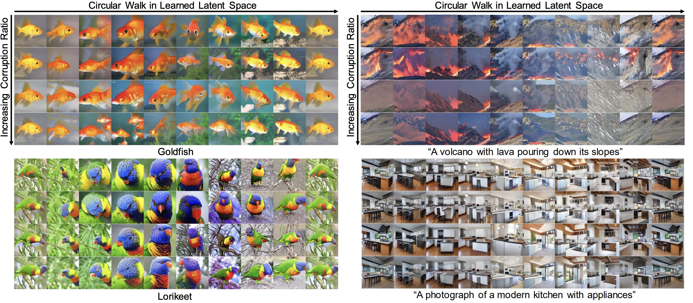

# Slight Corruption in Pre-training Data Makes Better Diffusion Models (NeurIPS 2024 Spotlight) 

<div align="center">

[](https://arxiv.org/pdf/2405.20494)&nbsp;
[](https://huggingface.co/DiffusionNoise)&nbsp;
<!-- [](https://huggingface.co/DiffusionNoise)&nbsp; -->

</div>




## Pre-trained Models

We release all of our pre-trained models (clean and corrupted) under the [DiffusionNoise](https://huggingface.co/DiffusionNoise) organization at huggingface. 
These includes LDM-4 class-to-image and text-to-image models and DiT-XL/2 class-to-image models, with corruption ratio ranging from 0 to 20.

| **Model Name**                                         | **Description**                                                                                   |
|--------------------------------------------------------|---------------------------------------------------------------------------------------------------|
| [dit-xl-2_imagenet_random_noise_20](https://huggingface.co/DiffusionNoise/dit-xl-2_imagenet_random_noise_20) | DiT-XL/2 model trained on ImageNet with 20% random noise.                                         |
| [dit-xl-2_imagenet_random_noise_10](https://huggingface.co/DiffusionNoise/dit-xl-2_imagenet_random_noise_10) | DiT-XL/2 model trained on ImageNet with 10% random noise.                                         |
| [dit-xl-2_imagenet_random_noise_7.5](https://huggingface.co/DiffusionNoise/dit-xl-2_imagenet_random_noise_7.5) | DiT-XL/2 model trained on ImageNet with 7.5% random noise.                                        |
| [dit-xl-2_imagenet_random_noise_5](https://huggingface.co/DiffusionNoise/dit-xl-2_imagenet_random_noise_5) | DiT-XL/2 model trained on ImageNet with 5% random noise.                                          |
| [dit-xl-2_imagenet_random_noise_2.5](https://huggingface.co/DiffusionNoise/dit-xl-2_imagenet_random_noise_2.5) | DiT-XL/2 model trained on ImageNet with 2.5% random noise.                                        |
| [dit-xl-2_imagenet_clean](https://huggingface.co/DiffusionNoise/dit-xl-2_imagenet_clean) | DiT-XL/2 model trained on clean ImageNet data without added noise.                                |
| [ldm_cc3m_clean_condnoise_gaussian](https://huggingface.co/DiffusionNoise/ldm_cc3m_clean_condnoise_gaussian) | Latent Diffusion Model (LDM) trained on CC3M with Gaussian conditional noise.                     |
| [ldm_cc3m_clean_condnoise_uniform](https://huggingface.co/DiffusionNoise/ldm_cc3m_clean_condnoise_uniform) | Latent Diffusion Model (LDM) trained on CC3M with uniform conditional noise.                      |
| [ldm_cc3m_random_noise_20](https://huggingface.co/DiffusionNoise/ldm_cc3m_random_noise_20) | LDM trained on CC3M with 20% random noise.                                                        |
| [ldm_cc3m_random_noise_15](https://huggingface.co/DiffusionNoise/ldm_cc3m_random_noise_15) | LDM trained on CC3M with 15% random noise.                                                        |
| [ldm_cc3m_random_noise_10](https://huggingface.co/DiffusionNoise/ldm_cc3m_random_noise_10) | LDM trained on CC3M with 10% random noise.                                                        |
| [ldm_cc3m_random_noise_7.5](https://huggingface.co/DiffusionNoise/ldm_cc3m_random_noise_7.5) | LDM trained on CC3M with 7.5% random noise.                                                       |
| [ldm_cc3m_random_noise_5](https://huggingface.co/DiffusionNoise/ldm_cc3m_random_noise_5) | LDM trained on CC3M with 5% random noise.                                                         |
| [ldm_cc3m_random_noise_2.5](https://huggingface.co/DiffusionNoise/ldm_cc3m_random_noise_2.5) | LDM trained on CC3M with 2.5% random noise.                                                       |
| [ldm_cc3m_clean](https://huggingface.co/DiffusionNoise/ldm_cc3m_clean) | LDM trained on clean CC3M data without added noise.                                               |
| [ldm_in1k_clean_condnoise_gaussian](https://huggingface.co/DiffusionNoise/ldm_in1k_clean_condnoise_gaussian) | LDM trained on ImageNet-1K with Gaussian conditional noise.                                       |
| [ldm_in1k_clean_condnoise_uniform](https://huggingface.co/DiffusionNoise/ldm_in1k_clean_condnoise_uniform) | LDM trained on ImageNet-1K with uniform conditional noise.                                        |
| [ldm_in1k_random_noise_20](https://huggingface.co/DiffusionNoise/ldm_in1k_random_noise_20) | LDM trained on ImageNet-1K with 20% random noise.                                                 |
| [ldm_in1k_random_noise_15](https://huggingface.co/DiffusionNoise/ldm_in1k_random_noise_15) | LDM trained on ImageNet-1K with 15% random noise.                                                 |
| [ldm_in1k_random_noise_10](https://huggingface.co/DiffusionNoise/ldm_in1k_random_noise_10) | LDM trained on ImageNet-1K with 10% random noise.                                                 |
| [ldm_in1k_random_noise_7.5](https://huggingface.co/DiffusionNoise/ldm_in1k_random_noise_7.5) | LDM trained on ImageNet-1K with 7.5% random noise.                                                |
| [ldm_in1k_random_noise_5](https://huggingface.co/DiffusionNoise/ldm_in1k_random_noise_5) | LDM trained on ImageNet-1K with 5% random noise.                                                  |
| [ldm_in1k_random_noise_2.5](https://huggingface.co/DiffusionNoise/ldm_in1k_random_noise_2.5) | LDM trained on ImageNet-1K with 2.5% random noise.                                                |
| [ldm_in1k_clean](https://huggingface.co/DiffusionNoise/ldm_in1k_clean) | LDM trained on clean ImageNet-1K data without added noise.                                        |


## Scripts

We also provided a bunch of scripts that can be used for utlizing/visualizaing these models.


**LDM-4 Class to Image Generation**
```
python scripts/ldm_in1k_cls2img.py --pretrained_model_name_or_path DiffusionNoise/ldm_imagenet_random_noise_2.5 --outdir visualization/in1k_randnoise_2.5 --ddim_steps 50 --scheduler dpm --batch_size 10 --n_samples 10 --scale 2.25 --fixed_code 
```

**LDM-4 Text to Image Generation**
```
python scripts/ldm_cc3m_text2img.py --pretrained_model_name_or_path DiffusionNoise/ldm_cc3m_random_noise_2.5 --prompt_data mscoco --outdir visualization/cc3m_randnoise_2.5 --ddim_steps 50 --scheduler dpm --batch_size 10 --n_samples 10 --scale 2.25 --fixed_code 
```

**DiT-XL/2 Class to Image Generation**
```
python scripts/dit_in1k_cls2img.py --pretrained_model_name_or_path DiffusionNoise/dit-xl-2_imagenet_random_noise_2.5 --prompt_data mscoco --outdir visualization/cc3m_randnoise_2.5 --ddim_steps 50 --scheduler dpm --batch_size 10 --n_samples 10 --scale 2.25 --fixed_code 
```


**Circular Walk over the Latents**
```
python scripts/in1k_circular_walk_cls2img.py
```


## Reference
```
@article{chen2024slight,
  title={Slight Corruption in Pre-training Data Makes Better Diffusion Models},
  author={Chen, Hao and Han, Yujin and Misra, Diganta and Li, Xiang and Hu, Kai and Zou, Difan and Sugiyama, Masashi and Wang, Jindong and Raj, Bhiksha},
  journal={NeurIPS 2024},
  year={2024}
}
```